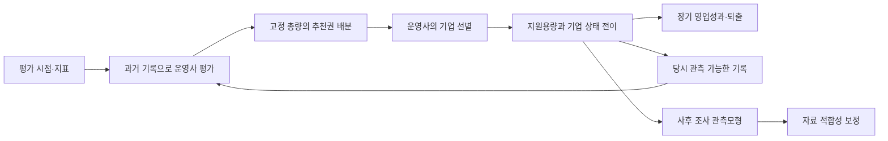

# TIPS Policy Lab

**평가기간과 성과 연동 배분이 운영사의 기업 선택·지원을 바꾸고, 장기 경제성과에 어떤 차이를 만드는지 탐색하는 ABM.**

Python 연구 엔진과 한국어 Streamlit 화면을 같은 코드로 제공합니다. 합성자료만으로 시작할 수 있으며 실제 Excel은 비공개 입력으로 연결합니다. TIPS의 인과적 효과·기업가치·투자수익률을 추정하는 프로그램은 아닙니다.



## Streamlit Community Cloud에 올리기

이 폴더의 **내용**을 GitHub 저장소 최상위에 올립니다. 공개 배포 ZIP도 같은 구조입니다.

1. Community Cloud에서 저장소와 브랜치를 선택합니다.
2. Main file path: **`app.py`**.
3. Python: **3.12**.
4. Deploy. 기본 화면은 합성자료이며 실험은 버튼을 눌러야 실행됩니다.

자세한 절차와 선택적 업로드 설정: [Cloud 배포](docs/CLOUD_DEPLOY.md). `.venv`, 원본 Excel, `data_private`, `results`, secrets는 올리지 않습니다. 라이선스·저자명은 저장소 소유자가 결정합니다.

## 로컬 실행

```bash
python -m venv .venv
# Windows
.venv\Scripts\python -m pip install -r requirements.txt
.venv\Scripts\python -m streamlit run app.py
# macOS / Linux
.venv/bin/python -m pip install -r requirements.txt
.venv/bin/python -m streamlit run app.py
```

이후 명령은 활성화한 가상환경의 `python` 또는 위 경로를 사용합니다. Windows에서는 `start.cmd` 또는 `start.ps1`도 사용할 수 있습니다. 기존 시제품 환경을 사용한다면 변경된 requirements를 다시 설치하세요.

## 연구 실행 순서

### E0: 원본 자료를 비공개 입력으로 변환

```bash
python -m tips_abm prepare --source "YOUR_ORIGINAL_WORKBOOK.xlsx" --out data_private/tips
python -m tips_abm audit --data data_private/tips --out results/audit
python -m tips_abm replay --data data_private/tips --out results/replay
```

현재 지원하는 원본은 `창업기업RAW` 시트의 2024 TIPS 성과조사 형식입니다. 다른 형식은 열 사전을 먼저 변경해야 합니다. 매출·이익 단위는 백만원, 명목값입니다. 삼중 0을 불명으로 바꾸려면 보정·실험 모두 `--strict-zero`를 적용합니다.

### E2: 보정

먼저 실행량을 확인합니다. `--execute` 없이는 보정/실험/진단/RL을 시작하지 않습니다.

```bash
python -m tips_abm calibrate --data data_private/tips --config configs/research.json --family worlds --candidates 120 --repetitions 5 --out results/calibration
# 계획을 검토한 뒤 같은 명령에 --execute 추가
```

세계별 `accepted.json`에 허용 모수 집합을 모두 저장합니다. 아무 집합도 통과하지 않으면 그 세계의 보정 정책실험을 진행하지 않습니다. 설정·입력·코드가 바뀌면 일치 여부를 확인하고 필요한 경우 다시 보정합니다.

단일 기본 세계 보정과 이전 진단:

```bash
python -m tips_abm calibrate --data data_private/tips --config configs/research.json --out results/base_calibration --execute
python -m tips_abm diagnose --data data_private/tips --config configs/research.json --accepted results/base_calibration/base/accepted.json --out results/diagnostics --execute
```

### E3: 37정책 × 27세계

```bash
python -m tips_abm run --data data_private/tips --config configs/research.json --family worlds --grid --accepted results/calibration --repetitions 30 --out results/pilot
# --execute 추가 후 파일럿 실행
python -m tips_abm precision --source results/pilot/raw.csv --half-width 0.1 --out results/precision
# 반복수를 고정한 뒤 별도 폴더로 연구 실행
python -m tips_abm run --data data_private/tips --config configs/research.json --family worlds --grid --accepted results/calibration --repetitions 200 --out results/main --execute
```

0.1의 목표 반폭은 예시입니다. 실제 단위·정책적으로 중요한 차이에 맞춰 D1에서 고정하세요. 공통 난수와 paired MCSE는 모형 난수의 오차를 줄이며 데이터 편향을 해결하지 않습니다. 중단한 `run`을 같은 명령으로 다시 시작하면 코드·입력·설정 해시가 같은 완료 작업을 재사용합니다.

### E4–E6: 메커니즘·민감도·정보

```bash
python -m tips_abm run --data data_private/tips --config configs/research.json --accepted results/base_calibration/base/accepted.json --family ablation --out results/ablation --execute
python -m tips_abm run --data data_private/tips --config configs/research.json --accepted results/base_calibration/base/accepted.json --family sensitivity --out results/sensitivity --execute
python -m tips_abm run --data data_private/tips --config configs/research.json --accepted results/base_calibration/base/accepted.json --family information --out results/information --execute
```

이 명령들은 기본 세계의 nuisance를 고정하고 기제·조건을 변경합니다. 구조를 바꾼 뒤 재보정하는 대안은 별도 `calibrate --family ...`로 실행해 구분하세요. 전역 공간 탐색은 `--family lhs --samples 24`; Sobol 지수나 최적정책 식별로 해석하지 않습니다.

매출 기준은 `--set '{"threshold":500}'`, 업종별 가정 시차는 `--set '{"sector_delay_shift":[0.4,-0.4,0.2,-0.2,0]}'`처럼 설정합니다. 순서는 C/J/M/G/Other이며 이 예시는 업종 시차의 실증 추정값이 아닙니다. Windows에서 JSON 인수 전달이 어렵다면 JSON config 파일에 값을 넣으세요. 기준을 바꾸면 상태·재무은행·보정을 다시 구성합니다.

자료 불확실성은 `--bootstrap 0`, `--bootstrap 1`, …을 E2와 E3에 동일하게 적용해 운영사별 군집을 재표본하고 매번 보정합니다. 결과는 별도 출력 폴더에 저장합니다.

### 선택 E7: 강화학습

```bash
python -m tips_abm rl --data synthetic --config configs/demo.json --episodes 100 --repetitions 30 --out results/rl
# 계획 검토 후 --execute
```

유한 행동 tabular Q-learning이며 별도 훈련·평가 seed를 사용합니다. 당시 관측되는 이익을 보상으로 쓰고 결측=0이라는 규범 선택을 명시합니다. 잠재력·미래 퇴출을 보상/상태에 유출하지 않습니다. 이 선택적 실험을 기본 37정책 결과와 혼합하지 않습니다.

## 결과 파일

`raw.csv`, `summary.csv`, `paired.csv`, `regret.csv`, `robust.csv`, `history.csv`, `manifest.json`, `report.zip`. 각 작업에는 배분표·명세·완료 마커가 있습니다. `--keep-panel`은 기업-연도 잠재 상태와 온라인 관측을 추가합니다. 원자료에서 파생된 상세결과도 공개 전에 공개 범위를 결정해야 합니다.

두 주결과: 누적 영업이익 / 약정예산, 연속 2년 흑자 달성 기업 수. 단가=1은 정규화된 추천권 예산입니다. 실제 사업비 대비 편익비나 투자수익률이 아닙니다. 보조결과: H시점 매출·퇴출·지연형 비중·집중도·잠재 품질. 모수별·세계별 결과를 유지하고 시나리오 비중을 확률로 부르지 않습니다.

## 구조와 부록

| 파일 | 역할 |
|---|---|
| `tips_abm/data.py` | Excel·합성·bootstrap·전이와 재무은행 |
| `config.py` | 모수와 37개 정책·27세계 |
| `model.py` | 연간 ABM·온라인 관측·survey view |
| `calibration.py` | 패턴 손실·허용 집합·이전 진단 |
| `experiments.py` | E1/E3–E6·재개·반복수 |
| `learning.py` | 선택적 E7 |
| `reporting.py` | paired MCSE·regret·Pareto·ZIP |
| `cli.py` / `app.py` | 배치 / 화면 |

- [ODD 전체 명세](docs/ODD.md)
- [연구 프로토콜](docs/RESEARCH_PROTOCOL.md)
- [문헌 대비 위치·명제](docs/LITERATURE_POSITIONING.md)
- [ODD+D·TRACE·STRESS 대응표](docs/REPORTING_CROSSWALK.md)
- [구현·실행 상태](IMPLEMENTATION_STATUS.md)
- [모델 카드](MODEL_CARD.md)

## 현재 실행 상태

코드 구현과 입력 정리를 제공하는 버전입니다. 자동 테스트, 모형 회복, 전체 보정·본실험, Community Cloud 배포 검증은 수행하지 않았습니다. 논문 결과나 검증 완료를 의미하지 않습니다.

공개 패키지 재생성: `python scripts/package_release.py --out ../tips_simulator_github.zip`. 명시한 코드·문서 목록만 포함하고 원자료나 가상환경을 탐색하지 않습니다.
